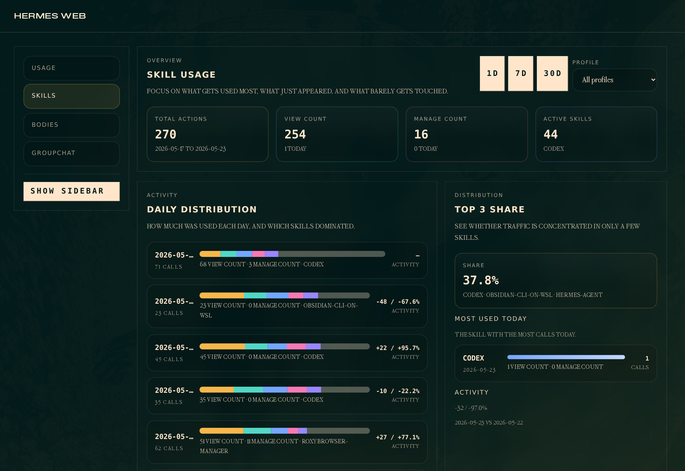
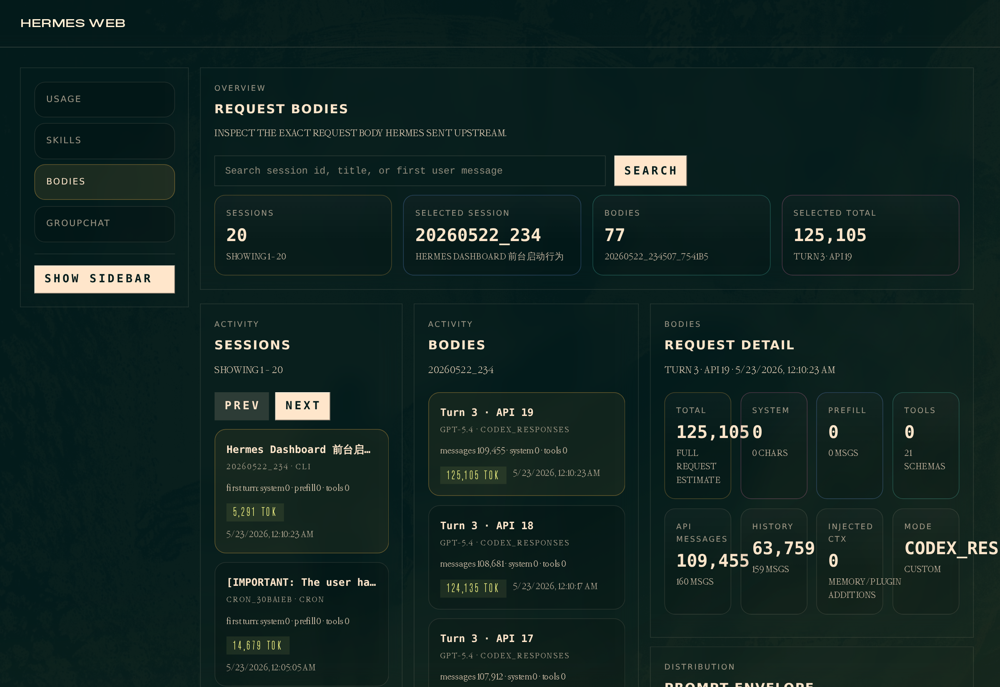
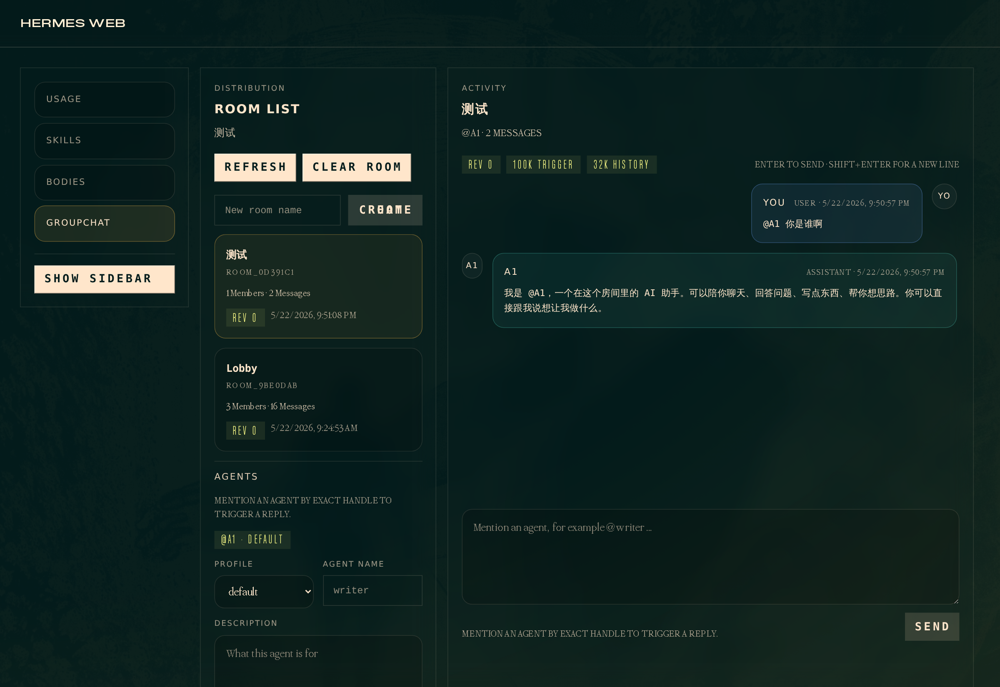

# Hermes Web

Dashboard plugin for inspecting the outbound LLM request Hermes sends on each
API call, with emphasis on request snapshots and usage totals.

Hermes Web turns the raw internals of a Hermes runtime into a focused
operations workspace:

- usage pressure and cache efficiency
- skill activity, now filterable by profile
- exact upstream request bodies and token estimates
- group chat rooms, agents, and message flow

## Screenshots

### Skills by profile



### Exact request bodies



### Group chat workbench



## Why this exists

The existing on-disk session snapshots under `~/.hermes/sessions/` are useful
for reconstructing conversation state, but they are not request-accurate:

- they store the current conversation snapshot, not one row per API request
- they do not preserve transport-specific request envelopes such as:
  - `system` for `anthropic_messages`
  - `instructions` for `codex_responses`
  - Bedrock Converse `system`
- they do not capture API-call-time injected context such as memory/plugin
  additions in the exact shape sent upstream
- they do not provide per-request token bucket estimates

`Hermes Web` fills that gap by persisting a dedicated request snapshot just before
the provider call is made, while also surfacing usage metrics from `state.db`.

## Data flow

1. `run_agent.py` builds `api_messages` and `api_kwargs`.
2. Immediately before the provider call, Hermes persists a request snapshot.
3. The snapshot is written into SQLite table `llm_request_snapshots`.
4. `plugins/hermes-web/dashboard/plugin_api.py` reads request snapshots and usage
   totals directly from `state.db`.
5. The dashboard UI renders:
   - usage totals and cache metrics
   - by-model/provider and by-day usage breakdowns
   - profile-aware skill analytics across `default` and `profiles/*`
   - prompt envelope (`system`, `instructions`, etc.)
   - messages
   - raw request JSON
   - tool schemas

## Architecture

### Dashboard plugin

- [plugins/hermes-web/dashboard/manifest.json](./dashboard/manifest.json)
  - registers the `Hermes Web` tab

- [plugins/hermes-web/dashboard/plugin_api.py](./dashboard/plugin_api.py)
  - direct SQLite reads from `state.db`
  - `GET /api/plugins/hermes-web/usage?days=7`
  - `GET /api/plugins/hermes-web/profiles`
  - `GET /api/plugins/hermes-web/skills?days=7`
  - `GET /api/plugins/hermes-web/sessions`
  - `GET /api/plugins/hermes-web/sessions/{session_id}/requests`
  - `GET /api/plugins/hermes-web/requests/{snapshot_id}`

- [plugins/hermes-web/dashboard/dist/index.js](./dashboard/dist/index.js)
  - plain IIFE dashboard UI
  - internal `Usage`, `Skills`, and `Requests` tabs
  - `Usage` tab with `1d / 7d / 30d` range selector
  - `Skills` tab with `1d / 7d / 30d` range selector and profile filter
  - `Requests` tab with session pagination and request drill-down

## What gets recorded

Each snapshot row records:

- session id / task id
- turn index / api call index
- provider / base URL / api mode / model
- whether this is the first turn
- approximate token buckets:
  - total
  - API messages
  - restored history
  - system
  - prefill
  - tools
  - injected context
- exact serialized request payload
- summarized flags like:
  - has system prompt
  - has prefill
  - has memory context
  - has plugin context

## Session pagination

The session list paginates at the plugin API layer:

- API accepts `limit` and `offset`
- backend fetches `limit + 1` rows to compute `has_more`
- frontend currently shows 20 sessions per page

Requests within a session are currently loaded up to 200 rows without paging.

## Usage endpoint

`GET /api/plugins/hermes-web/usage?days=7` returns:

- `totals`
  - `sessions_started`
  - `sessions_with_usage`
  - `input_tokens`
  - `output_tokens`
  - `cache_read_tokens`
  - `cache_write_tokens`
  - `reasoning_tokens`
  - `api_calls`
  - `prompt_side_total`
  - `cache_hit_rate_pct`
  - `cache_hit_rate_incl_write_pct`
  - `cache_read_vs_input_ratio`
- `by_model`
  - grouped by `model + billing_provider`
- `by_day`
  - grouped by local calendar day

## Skills endpoint

`GET /api/plugins/hermes-web/skills?days=7` returns:

- `profile`
  - current profile filter, for example `all`, `default`, `writer`
- `profiles`
  - discovered profile list from `~/.hermes/state.db` and `~/.hermes/profiles/*/state.db`
- `summary`
  - `total_skill_loads`
  - `total_skill_edits`
  - `total_skill_actions`
  - `distinct_skills_used`
- `by_day`
  - grouped by local calendar day
  - each day includes nested `skills` rows with `view_count`, `manage_count`, and `total_count`
- `top_skills`
  - grouped by skill name
  - includes `view_count`, `manage_count`, `total_count`, `percentage`, `last_used_at`
  - each skill also carries per-profile breakdowns when multiple profile DBs are included

## Development notes

- This plugin intentionally uses SQLite, not extra JSON files, because request
  inspection and usage aggregation both need direct indexed reads from
  `state.db`.
- The dashboard tab includes local UI i18n in `dist/index.js`, using
  `SDK.useI18n()` locale detection with `en` / `zh` / `zh-hant` support and
  English fallback.
- The plugin backend does not depend on `SessionDB` read helpers. It queries
  SQLite directly so the dashboard keeps working across core helper drift.
- The plugin is read-only. It does not mutate sessions or request data.
- Historical sessions created before this feature landed will not have request
  snapshots. Only new requests are captured.

## Validation commands

Use these after changes:

```bash
python3 -m py_compile \
  plugins/hermes-web/dashboard/plugin_api.py

node --check plugins/hermes-web/dashboard/dist/index.js

# FastAPI TestClient smoke test against /api/plugins/hermes-web/usage
```

## thanks

https://linux.do/
